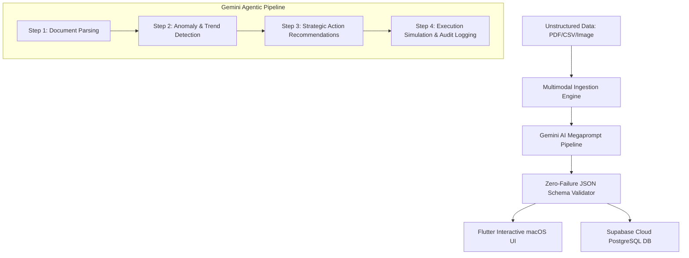

# Implementation Plan: InsightFlow Autonomous Agent

This document details the architectural design and step-by-step implementation plan for **InsightFlow**, an autonomous content-to-action AI agent built for the AI Seekho Hackathon.

---

## 🎯 Project Objective
To build an agentic application that ingests unstructured multimodal documents (PDFs, CSVs, Images), performs advanced analytical reasoning, outputs highly structured business recommendations, and simulates programmatic action execution—persisting all states in Supabase.

---

## 🏗️ Architecture Design & AI Workflow

### 🧠 Advanced AI & Agentic Technologies Used:
1. **Gemini Multimodal Models (Gemini 1.5/2.0 Flash):** Processes textual PDFs, tabular CSV data, and dashboard images concurrently without requiring separate OCR steps.
2. **Mega-Prompt Reasoning Pipeline:** Orchestrates an agentic "chain of thought" (CoT) that groups multiple reasoning cycles (Parsing -> Critical Thinking -> Action Selection -> Simulation Log Generation) inside a single, highly structured API execution payload.
3. **Deterministic Output Structuring:** Utilizes JSON schema configurations to force the generative model to output strict JSON data. This completely avoids formatting failures and ensures seamless integration with Supabase JSONB tables.
4. **Supabase Trace Integration:** Saves the analytical trace and execution history to dynamic Postgres columns for complete auditability.

---

## 📋 Phase-by-Phase Execution Checklist

### Phase 1: Environment & SDK Setup [COMPLETED]
- [x] Configure Supabase database schema and enable JSONB auditing.
- [x] Integrate Google Generative AI Dart package in Flutter.
- [x] Setup `.env` configuration for API keys.

### Phase 2: Ingestion & Parsing Services [COMPLETED]
- [x] Implement multi-format file pickers in Flutter.
- [x] Build backend parser that converts local files into safe base64 payloads for Gemini.
- [x] Setup dynamic MIME-type detection.

### Phase 3: Agentic Pipeline & UI development [COMPLETED]
- [x] Write and test the 5-step agentic Mega-Prompt.
- [x] Implement the macOS-style interactive terminal UI showing the agent's thought process step-by-step.
- [x] Connect database writing methods to log every successful simulation.

### Phase 4: Verification & Deployment [COMPLETED]
- [x] Build responsive Flutter Web release.
- [x] Build optimized Android release APK.
- [x] Deploy to Vercel and push APK to GitHub.
